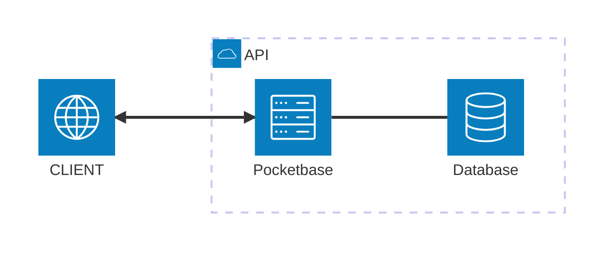

# workout-tracker

this is going to be a web-app to allow me to track my workouts

# Roadmap

1. Authentication
a. I want the user to be able to authenticate, do I need email? probably just username and password would be enough, would need email for account recovery if the user would want such a feature.
b. I need to be able to split the app data based on the user given that I want the user to be able to only access their own workout data

2. Features
a. record your exercise that you have completed allowing you to add sets reps and weight (with measurement) easily.
    - looking at adding a simple ui to allow this.
    - allow for weight, distance and time measurement
b. record you entire workouts (multiple exercises)
c. save workouts for the user to be able to quickly start a new workout without needing to go through the steps of adding a new exercise each time you do it.
    - Users will be able to save and update the workout then any new recorded workout will use the updated saved workout
d. recording user weight and attaching it to the workout giving the user a view on their weight as they work (optional feature)

3. Payment
a. I won't be able to afford this if the app scales so will want to be able to charge users for the app. I'm thinking £4 per month for a user
b. I want users to be able to experience the app before needing to pay so will need to look into using a system that would allow users to record x number of workouts with x exercises before they need to pay to access the app
    - maybe something like 30 workouts recorded to allow the users time to learn to use the app and maybe become dependent on the app, reads would be free for the users, reading shouldn't be the bottleneck I'm hoping
    - users can only save 3 workouts

## Ideas
1. Trainer intergration
a. allow trainers to share created workouts with their clients without clients needing to create their own workout.
b. allow clients to share their completed workouts with their trainers meaning trainers can see the progress of their client over the long term allowing them to adjust the training schedule based on the progress of their client.

# Architecture Diagram

# Notes and other thoughts to keep in mind
- use AWS SQS to be able to queue write operations during moments of high demand to allow me to keep the server costing down to a minimum, if queuing the requests works to improve the performance then it would be cheap way to gain extra performance

