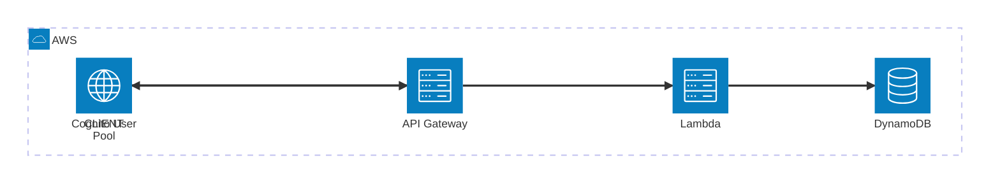

# workout-tracker

this is going to be a web-app to allow me to track my workouts

# Roadmap

1. Authentication
a. Username and password authentication via **AWS Cognito User Pool** — email is optional and used only for account recovery.
b. A Cognito authorizer on API Gateway ensures per-user data isolation — each request is validated against the user's JWT before any data access.

2. Features
a. record your exercise that you have completed allowing you to add sets reps and weight (with measurement) easily.
    - looking at adding a simple ui to allow this.
    - allow for weight, distance and time measurement
b. record you entire workouts (multiple exercises)
c. save workouts for the user to be able to quickly start a new workout without needing to go through the steps of adding a new exercise each time you do it.
    - Users will be able to save and update the workout then any new recorded workout will use the updated saved workout
d. recording user weight and attaching it to the workout giving the user a view on their weight as they work (optional feature)

3. Payment
a. I won't be able to afford this if the app scales so will want to be able to charge users for the app. I'm thinking £4 per month for a user
b. I want users to be able to experience the app before needing to pay so will need to look into using a system that would allow users to record x number of workouts with x exercises before they need to pay to access the app
    - maybe something like 30 workouts recorded to allow the users time to learn to use the app and maybe become dependent on the app, reads would be free for the users, reading shouldn't be the bottleneck I'm hoping
    - users can only save 3 workouts
    - The freemium limits are enforced via **atomic counters** on the `UserProfiles` table (`workoutsRecorded` and `savedTemplateCount`). These are incremented atomically on each write, so no extra read is needed to check the limit before allowing a write.

## Ideas
1. Trainer integration
a. allow trainers to share created workouts with their clients without clients needing to create their own workout.
b. allow clients to share their completed workouts with their trainers meaning trainers can see the progress of their client over the long term allowing them to adjust the training schedule based on the progress of their client.
c. Note: cross-user queries (e.g. a trainer viewing all of a client's workouts) will be easier to implement after migrating to a relational database where joins and secondary indexes are more natural.

### Sharing design within DynamoDB

Two approaches are viable without leaving DynamoDB:

**Option A — Copy-on-share (simplest)**

When a trainer shares a template with a client, Lambda writes a copy of the template item directly into the client's own `SavedTemplates` partition (`PK=clientUserId`). The client's existing read path requires no changes — their templates all live under their own `userId` as normal.

- ✅ Zero extra tables or GSIs
- ✅ No change to existing read paths
- ❌ Template changes made by the trainer after sharing do not propagate to clients (snapshot-in-time)

Suitable for simple one-way "push a template to a client" flows where the trainer doesn't need to keep templates in sync.

**Option B — SharedTemplates table with a GSI (live sharing)**

Add a fourth table `SharedTemplates` that acts as a sharing ledger:

| Table | PK | SK | GSI PK | GSI SK |
|---|---|---|---|---|
| `SharedTemplates` | `ownerId` | `SHARE#<recipientId>#<templateId>` | `recipientId` | `TEMPLATE#<templateId>` |

The SK is ordered `SHARE#<recipientId>#<templateId>` so that a trainer can query `PK=ownerId, SK begins_with SHARE#<recipientId>` to list everything shared with a specific client in one range query, which is expected to be a common access pattern for trainer management UIs.

- **Owner query** (`PK=ownerId`) — a trainer can fetch all templates they have shared and see which clients received each one.
- **Recipient query** (GSI: `PK=recipientId`) — a client can fetch all templates shared with them in a single query without scanning the whole table.
- The item stores a reference to the original `SavedTemplates` entry (`ownerId` + `templateId`), so Lambda fetches the live template in a second read, meaning updates made by the trainer are always reflected. When loading a client's full template list, Lambda can resolve multiple references in parallel using `BatchGetItem` to avoid N serial reads.

A similar pattern works for clients sharing completed workouts with their trainer:

| Table | PK | SK | GSI PK | GSI SK |
|---|---|---|---|---|
| `SharedWorkouts` | `clientId` | `SHARE#<trainerId>#<workoutId>` | `trainerId` | `WORKOUT#<workoutId>` |

The trainer queries the GSI (`PK=trainerId`) to pull all workouts shared with them across all clients, and uses `BatchGetItem` against the `Workouts` table to resolve the full workout items.

**Relationship management** — a `TrainerClients` table (or a `relationships` attribute on `UserProfiles`) can record which trainer–client pairs exist, so Lambda can enforce that sharing is only permitted between linked users before writing to `SharedTemplates`.

# Architecture Diagram

# DynamoDB Document Design

Three tables are used, designed to minimise read/write operations and support the freemium model without extra reads:

| Table | PK | SK | Notes |
|---|---|---|---|
| `UserProfiles` | `userId` | — | Stores user data, subscription status, and atomic freemium counters (`workoutsRecorded`, `savedTemplateCount`) |
| `Workouts` | `userId` | `WORKOUT#<timestamp>#<workoutId>` | Denormalised — exercises and sets stored inline within the item. 1 read retrieves a full workout instead of 1 (workout) + N (exercises) + sets reads. Body weight is logged inline and will be extracted to its own table during a future SQL migration. |
| `SavedTemplates` | `userId` | `TEMPLATE#<templateId>` | Saved workout templates |

**Key design decisions:**
- **Denormalised workout storage** — exercises and sets are embedded directly in the workout item, reducing read amplification (one DynamoDB `GetItem` returns the full workout).
- **Atomic counters** — `workoutsRecorded` and `savedTemplateCount` on `UserProfiles` are incremented using DynamoDB atomic updates on each write, so the freemium limit check requires no extra read.
- **Sort key pattern** — `WORKOUT#<timestamp>#<workoutId>` gives natural reverse-chronological ordering when querying a user's workout history.
- **Future migration path** — because exercises and sets are stored inline, migrating to SQL involves decomposing each workout item into normalised relational tables (`workouts`, `exercises`, `sets`). The denormalised structure maps deterministically to these SQL rows, making the migration mechanical rather than a data-modelling redesign.

# Notes and other thoughts to keep in mind
- **Cost efficiency** — at low usage, DynamoDB on-demand + Lambda free tier + Cognito free tier means the app runs for effectively $0/mo, making it ideal for the early stages of the project.
- **Future migration path** — as the app scales and fixed infrastructure costs become justifiable, the plan is to migrate from DynamoDB to PostgreSQL or self-hosted PocketBase (Hetzner). The denormalised DynamoDB design is intentionally structured so each item maps cleanly to SQL rows, keeping this migration straightforward.
- **Horizontal scaling** — DynamoDB on-demand mode handles burst writes natively without any additional queuing infrastructure, removing the need for SQS write queuing at this scale.

